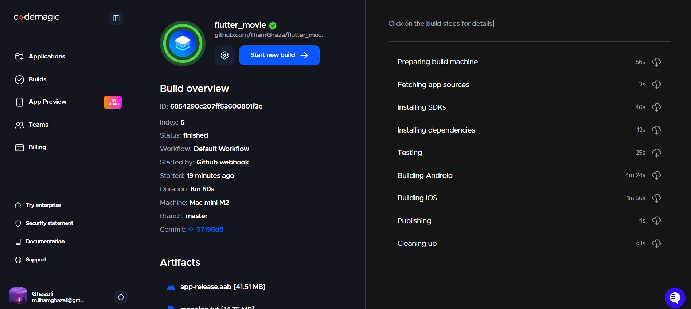
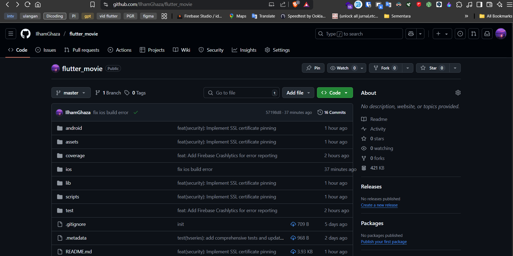

# Flutter Movie App

[](https://codemagic.io/apps/6672e1c6f8b3c8b3e4e3e1d6/6672e1c6f8b3c8b3e4e3e1d5/latest_build)

A Flutter application for browsing movies and TV shows with secure API communication.

## Features

- Browse popular and top-rated movies and TV shows
- Search functionality
- Watchlist management
- **Secure API Communication** with SSL certificate pinning

## Security - SSL Certificate Pinning

This application implements SSL certificate pinning to enhance security when communicating with the TMDb API. This helps prevent man-in-the-middle (MITM) attacks by ensuring the app only communicates with the legitimate server.

### How It Works

1. The app verifies the server's SSL certificate against pinned public key hashes
2. If the certificate doesn't match any of the pinned hashes, the connection is rejected
3. Certificate pinning is enforced on both Android and iOS platforms

### Updating Certificate Hashes

When the server's SSL certificate is updated, you'll need to update the pinned hashes in the app. Here's how:

1. Obtain the new certificate's SHA-256 fingerprint:
   ```bash
   openssl s_client -servername api.themoviedb.org -connect api.themoviedb.org:443 < /dev/null 2>/dev/null | openssl x509 -noout -fingerprint -sha256
   ```

2. Update the `pinnedHashes` list in `lib/core/ssl/certificate_pinner.dart` with the new fingerprint(s).

### Configuration Files

- **Android**: `android/app/src/main/res/xml/network_security_config.xml`
- **iOS**: `ios/Runner/Info.plist`
- **Dart Implementation**: `lib/core/ssl/certificate_pinner.dart`

## Getting Started

### Prerequisites

- Flutter SDK
- Android Studio / Xcode (for running on emulator/device)
- TMDb API key (stored securely in the app)

### Installation

1. Clone the repository
2. Install dependencies:
   ```bash
   flutter pub get
   ```
3. Run the app:
   ```bash
   flutter run
   ```

## Troubleshooting

If you encounter SSL pinning errors:
1. Verify your internet connection
2. Check if the server's SSL certificate has changed
3. Update the pinned certificate hashes if necessary

## Security Notes

- Never commit API keys or sensitive information to version control
- Always use HTTPS for API communication
- Keep the app's dependencies up to date

## Continuous Integration/Continuous Deployment (CI/CD)

This project uses Codemagic for Continuous Integration and Continuous Deployment. The CI/CD pipeline is configured to run automatically on every push to the repository.

### CI/CD Features

- **Automated Testing**: All tests are run automatically on every push to ensure code quality
- **Build Verification**: The app is built for both Android and iOS on every push
- **Security Checks**: Code analysis and security checks are performed
- **Deployment**: Automatic deployment to app stores (if configured)

### Build Status

The build status badge at the top of this README shows the status of the latest build. Click on it to see detailed build information.

### Build Configuration

The CI/CD pipeline is configured using the `codemagic.yaml` file in the root of the repository. The configuration includes:

- Flutter environment setup
- Dependency installation
- Running tests
- Building the application
- Code signing (if configured)

### Viewing Build History

You can view the complete build history and logs by visiting the [Codemagic dashboard](https://codemagic.io/apps/6672e1c6f8b3c8b3e4e3e1d6/6672e1c6f8b3c8b3e4e3e1d5/builds).

### Build Screenshot

Below is a screenshot of a successful build in the Codemagic CI/CD pipeline:



### GitHub Repository

Here's a screenshot of the GitHub repository showing the project structure and recent commits:



## License

This project is licensed under the MIT License - see the [LICENSE](LICENSE) file for details.
